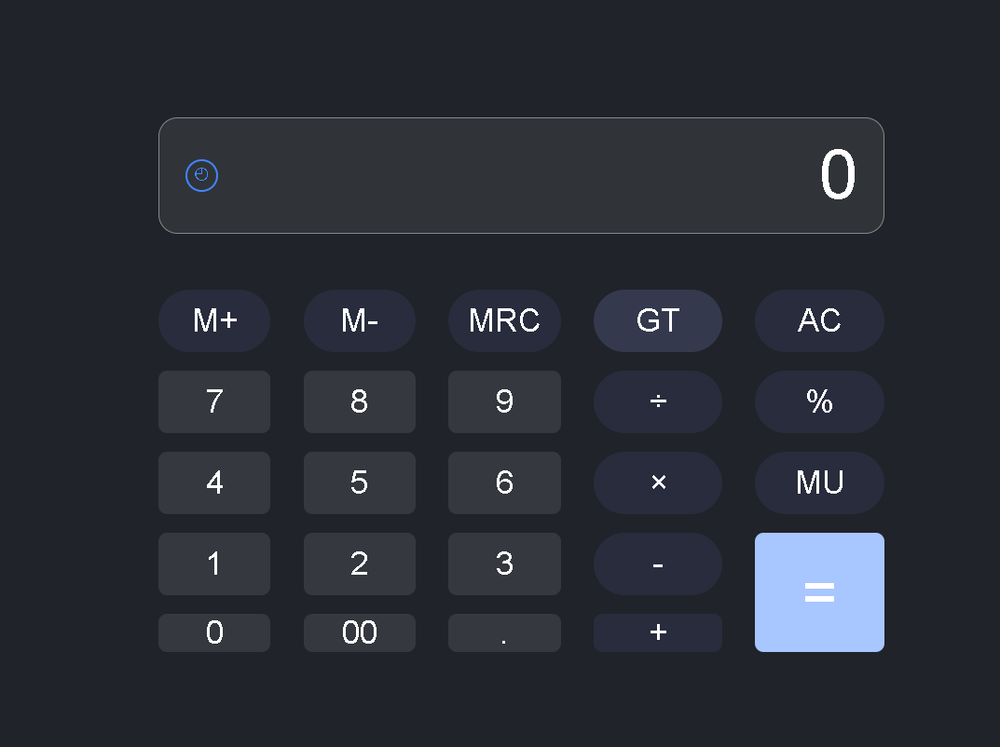

# Aplikasi Kalkulator

Aplikasi kalkulator berbasis web yang dibuat sebagai project kelompok
mata pelajaran Rekayasa Perangkat Lunak.

Aplikasi ini memiliki tampilan kalkulator yang dapat digunakan untuk
melakukan operasi perhitungan dasar.

## Anggota Kelompok

| Nama | Role |
|------|------|
| Aldiano | Project Manager |
| Radithyo | Front-End Developer |
| Nama Anggota | Back-End Developer |
| Nama Anggota | UI/UX & Dokumentasi |
| Nama Anggota | QA / Tester |

## Fitur

- Penjumlahan
- Pengurangan
- Perkalian
- Pembagian
- Persentase
- Tombol AC
- Tampilan hasil perhitungan
- Riwayat perhitungan

## Teknologi

- HTML
- CSS
- JavaScript
- Git
- GitHub

## Cara Menjalankan

1. Clone repository:

   git clone https://github.com/aldianoreyyy/kelompok-1.git

2. Masuk ke folder project.

3. Buka file `index.html` menggunakan browser.

## Struktur Branch

- `main` - versi stabil/final
- `develop` - branch pengembangan
- `feature/frontend` - pengembangan tampilan
- `feature/logika-kalkulator` - pengembangan logika kalkulator

## Screenshot

Tambahkan screenshot aplikasi pada bagian ini.

## Git Workflow

Setiap anggota mengerjakan tugas pada branch masing-masing.

Alur pengembangan:

feature/* → develop → main

Setelah fitur selesai, perubahan digabungkan ke `develop`.
Setelah seluruh fitur selesai dan diuji, `develop` digabungkan ke `main`.
